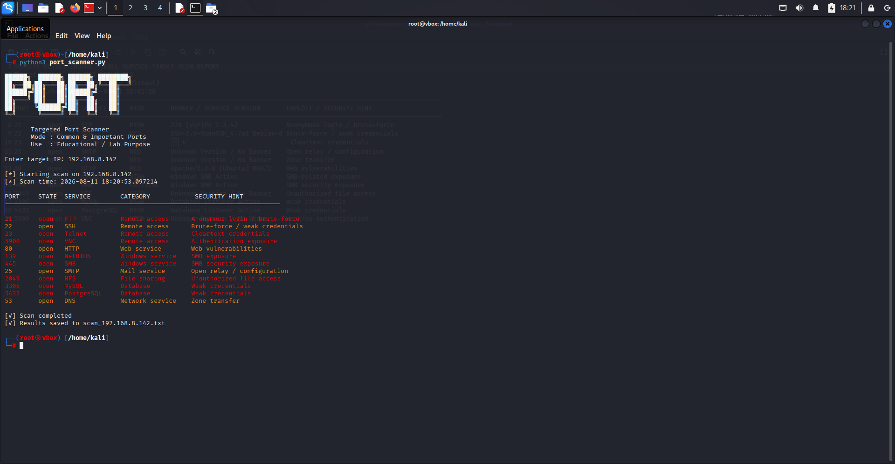
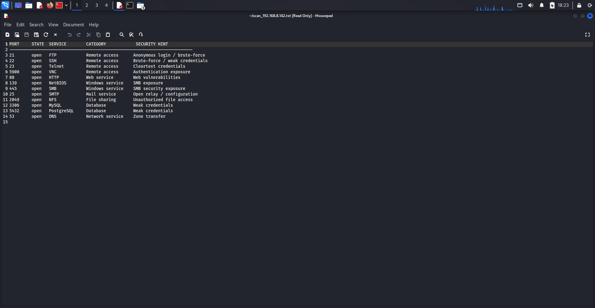

# Python Port Scanner

A lightweight Python-based TCP port scanner designed for educational purposes, cybersecurity labs, and authorized network testing.

The scanner checks a predefined list of commonly used and security-relevant TCP ports, identifies open ports, associates them with known services, provides basic security context, and saves the results to a text report.

## Overview

This project was created to understand the fundamentals of network reconnaissance and how a basic port scanner works internally using Python.

Instead of relying entirely on existing tools, the scanner uses Python's built-in `socket` module to perform TCP connection attempts against selected ports.

## Features

- Scans commonly used TCP ports
- Detects open ports using TCP connections
- Identifies services associated with detected ports
- Groups services by category
- Provides basic security hints
- Assigns predefined risk levels
- Uses colored terminal output
- Records the scan date and time
- Generates a text-based scan report
- Uses only Python standard library modules

## Port Categories

The scanner currently includes ports associated with:

### Remote Access

- FTP — 21
- SSH — 22
- Telnet — 23
- Alternative SSH — 2222
- RDP — 3389
- VNC — 5900

### Web Services

- HTTP — 80
- HTTPS — 443
- HTTP Development — 8000
- HTTP Alternative — 8008
- HTTP Alternative — 8080
- HTTPS Alternative — 8443
- HTTP Alternative — 8888

### Windows / Active Directory

- RPC — 135
- NetBIOS — 139
- SMB — 445
- LDAP — 389
- LDAPS — 636
- Global Catalog — 3268

### Mail Services

- SMTP — 25
- POP3 — 110
- IMAP — 143
- SMTPS — 465
- SMTP Submission — 587
- IMAPS — 993
- POP3S — 995

### Databases

- MSSQL — 1433
- Oracle — 1521
- NFS — 2049
- MySQL — 3306
- PostgreSQL — 5432
- Redis — 6379
- MongoDB — 27017
- Elasticsearch — 9200

### Containers / DevOps

- Docker — 2375
- Docker TLS — 2376
- Kubernetes API — 6443
- Kubelet — 10250

### Network / Infrastructure

- DNS — 53
- TFTP — 69
- NTP — 123
- SNMP — 161

## How It Works

The scanner follows a simple process:

```text
Target IP
    |
    v
Predefined Port List
    |
    v
Create TCP Socket
    |
    v
Attempt Connection
    |
    v
Is Port Open?
   / \
 Yes  No
  |    |
  v    v
Display  Ignore
Service
  |
  v
Security Hint
  |
  v
Save Result
```

For each port, the program:

1. Creates a TCP socket.
2. Sets a connection timeout.
3. Attempts to connect to the target IP and port.
4. Checks the result returned by `connect_ex()`.
5. If the connection succeeds, the port is considered open.
6. Displays the associated service and security information.
7. Writes the result to the scan report.
8. Closes the socket before moving to the next port.

## Risk Classification

The scanner uses predefined risk classifications:

| Risk | Meaning |
|---|---|
| LOW | Lower-priority service exposure |
| MED | Moderate security interest |
| HIGH | Potentially significant exposure |
| CRITICAL | High-priority service exposure |

These classifications are based on the predefined service information in the program.

An open port **does not automatically mean that the target is vulnerable**.

## Example Output

The scanner was tested in a controlled virtual machine lab environment.

Example detected services included:

```text
21       open   FTP            Remote access       Anonymous login / brute-force
22       open   SSH            Remote access       Brute-force / weak credentials
23       open   Telnet         Remote access       Cleartext credentials
5900     open   VNC            Remote access       Authentication exposure
80       open   HTTP           Web service         Web vulnerabilities
139      open   NetBIOS        Windows service     SMB exposure
445      open   SMB            Windows service     SMB security exposure
25       open   SMTP           Mail service        Open relay / configuration
2049     open   NFS            File sharing        Unauthorized file access
3306     open   MySQL          Database             Weak credentials
5432     open   PostgreSQL     Database             Weak credentials
53       open   DNS            Network service      Zone transfer
```

## Screenshots

### Scanner Running



### Generated Scan Report



## Report Generation

After the scan completes, the program generates a text file using the target IP in the filename.

Example:

```text
scan_192.168.x.x.txt
```

The report contains the open ports detected during the scan along with their associated service, category, and security hint.

## Technology

- Python 3
- Python `socket` module
- Python `datetime` module
- TCP/IP networking
- File handling
- ANSI terminal colors

No external Python packages are required.

## Running the Scanner

Run the program with:

```bash
python3 port_scanner.py
```

Enter the IP address of an authorized target when prompted:

```text
Enter target IP: 192.168.x.x
```

The scanner will then test the predefined ports and display any detected open services.

## Learning Objectives

This project was developed to gain practical experience with:

### Python

- Variables
- User input
- Dictionaries
- Tuples
- Loops
- Conditional statements
- String formatting
- File handling
- Python modules

### Networking

- IP addresses
- TCP connections
- Network ports
- Socket programming
- Connection timeouts
- Basic service identification

### Cybersecurity

- Network reconnaissance
- Attack surface identification
- Service exposure
- Basic security classification
- Port scanning concepts

## Limitations

This is an educational port scanner and is intentionally lightweight.

It currently does not provide:

- UDP scanning
- Full port-range scanning
- Operating system detection
- Comprehensive service version detection
- CVE identification
- Vulnerability verification
- Automated exploitation
- Nmap-equivalent functionality
- Multithreaded scanning

The project focuses on understanding the fundamental concepts behind TCP port scanning.

## Future Improvements

Possible future improvements include:

- Custom port ranges
- Command-line arguments
- UDP scanning
- Service banner grabbing
- Service version detection
- JSON report generation
- CSV report generation
- Configurable connection timeout
- Multithreaded scanning
- Improved error handling
- Logging
- Unit testing

## Security & Authorization

This tool should only be used against systems that you own or have explicit permission to test.

Recommended environments include:

- Personal virtual machines
- Home cybersecurity labs
- CTF environments
- Authorized penetration-testing environments
- Security training environments

Do not scan systems or networks without authorization.

## Disclaimer

This project is provided for educational and authorized security-testing purposes only.

The author is not responsible for misuse of this tool.

Always obtain appropriate authorization before scanning a system or network.
